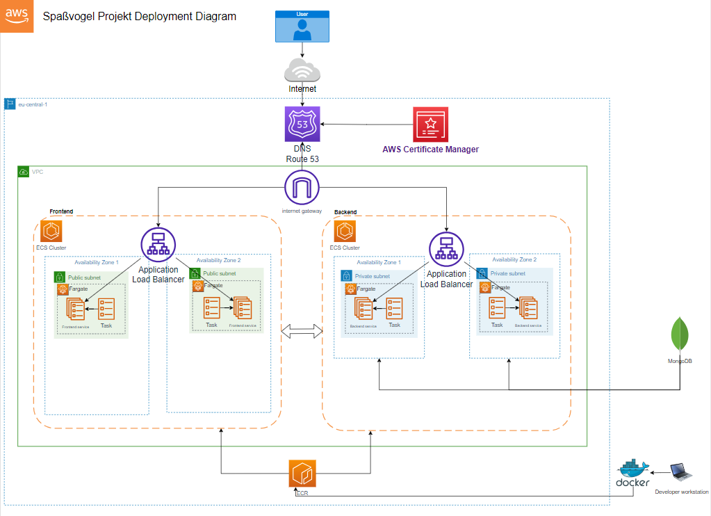

# Witz Project (SpaßVogel Projekt)

---

# Ziel

Wenn die Stunden dahin schleichen und die Tage lang sind, brauche ich ein wenig Aufheiterung. Dafür möchte ich den Spassvogel nutzen. Bei jedem Aufruf bekomme ich einen neuen Witz serviert, den ich im Nachgang auch bewerten kann. Dann möchte ich eine Auflistung der besten Witze angezeigt bekommen.

---

### Anforderungen

***1.Witz-Datenbank***

- Aufbau einer Witz-Datenbank, die eine breite Sammlung von Witzen enthält.

***2.Witz-Generierung***

- Implementierung eines Mechanismus zur zufälligen Auswahl und Anzeige eines Witzes bei jedem Aufruf.
  
***3.Benutzeroberfläche***

- Erstellung einer einfachen, ansprechenden Benutzeroberfläche, um den Spaßvogel aufzurufen.
  
***4.Datenaktualisierung***

- Regelmäßige Aktualisierung der Witz-Datenbank, um sicherzustellen, dass immer frische und unterhaltsame Witze zur Verfügung stehen.

***5.Interaktionsmöglichkeit***

- Hinzufügen einer Option, um Witze zu bewerten oder eigene Witze beizutragen, um die Nutzerinteraktion zu fördern.

***6.Verhältnis von Witzen***

- Implementierung eines Systems, um sicherzustellen, dass keine Witze zu oft wiederholt werden und die Auswahl zufällig und vielfältig bleibt.

***7.Statistik und Analyse***

- Sammlung und Speicherung der Witze-Bewertungen.
Generierung einer Top10 Witze-Liste.
