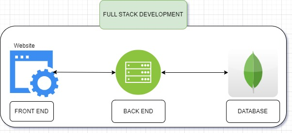

This project is a full-stack application built with the MEAN stack (MongoDB, Express, Angular, Node.js).

## Description

The project is designed to manage jokes through CRUD operations. It has a front-end built with Angular for the user interface and a back-end built with Node.js, Express, and MongoDB to handle data storage.

## Backend

### Dependencies

- `dotenv`: Used to load environment variables.
- `express`: Node.js web application framework used for creating APIs.
- `mongoose`: MongoDB object modeling tool.
- `jsonwebtoken`: Used for user authentication and authorization.
- `cors`: Middleware to enable CORS (Cross-Origin Resource Sharing).
- `cookie-parser`: Middleware for handling cookies in Express.

### Backend Structure

The backend directory includes:

- `config`: Contains the database configuration (`db.js`).
- `controllers`: Includes controllers for different entities (`jokesController.js`, `userController.js`).
- `data`: Possibly for any seed data.
- `middlewares`: Error handling middlewares (`errorHandlers.js`).
- `models`: Contains database models (`jokeModel.js`, `userModel.js`).
- `routes`: API routes (`apiRoutes.js`, `userRoutes.js`).
- `server.js`: Entry point for the Node.js server.

## Database

The application uses MongoDB for data storage.

## Usage

1. Install dependencies: `npm install`.
2. Set environment variables in a `.env` file.
3. Start the server: `npm start`.

## Backend Operations

### Jokes

- `GET /jokes`: Retrieve all jokes.
- `GET /jokes/:id`: Retrieve a joke by ID.
- `POST /jokes`: Add a new joke.
- `PUT /jokes/:id`: Update a joke's rating or text.
- `DELETE /jokes/:id`: Delete a joke.

### Users

- `POST /users/register`: Register a new user.
- `POST /users/login`: Authenticate user and generate a token.
- `POST /users/logout`: Log out user (frontend functionality).

## Frontend

The frontend is built with Angular.

